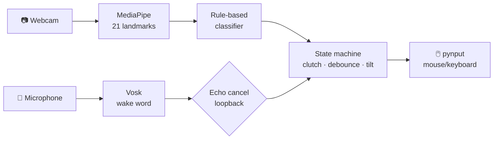

<div align="center">


# 🖐️ MaraMouse

### Control your PC with hand gestures — turn your webcam into a mouse

[](https://www.python.org/)
[](https://developers.google.com/mediapipe)
[](https://opencv.org/)
[](#)
[](#)
[](#)
[](#)
[](LICENSE)

*Move the cursor, click, scroll, zoom and toggle dictation — touching nothing.*

**English** · [Italiano](README.md)

</div>

---

## ✨ What it is

**MaraMouse** turns your laptop webcam into a gesture mouse. The cursor moves **by delta** like a physical mouse (not by absolute position): open your hand and move it, the cursor follows; make a fist to "lift off" and reposition your hand — exactly like picking a mouse up off the mat.

It runs **locally, CPU-only, at zero cost**: no cloud, no GPU, no subscriptions.

## 🎯 Gestures

All gestures work only when the system is **engaged** (see [Engagement](#-engagement--audio-feedback)).

| Gesture | Action |
|:--|:--|
| ✋ **Open hand** moving | Move the cursor |
| ✊ **Fist** | Pause / lift-off (reposition your hand) |
| 🤙 **Phone sign** (thumb+pinky) ~1s | Toggle engage / standby |
| ☝️ **Index raised** from fist | Left click |
| ☝️☝️ **Index+middle raised** together | Double click |
| 🖕 **Middle raised** alone | Right click |
| 🖐️ **3 fingers** (I+M+R) + hand tilt | Vertical scroll (joystick) |
| 🤏 **Pinch** thumb-index | Zoom in / out |
| 🤘 **Horns** (index+pinky) | Toggle dictation (Win+H) |

## 🔊 Engagement & audio feedback

The system starts in **standby** and won't touch the mouse. Activation is **two-factor** (voice + gesture) to prevent accidental triggers.

### Activation flow

1. **IDLE** — the system listens to the microphone. Say **"Maramouse"** to activate.
2. **ARMED** — voice recognized, double beep (600+800 Hz). Show your hand → *whoosh*. You have **8 seconds** to make the **phone sign** (~1s).
3. **ACTIVE** — 900 Hz beep. Gestures control the mouse. To disengage: phone sign ~1s, or wait ~45s of inactivity.

| Sound | Meaning |
|:--|:--|
| 🔔 Double beep (600+800 Hz) | Voice recognized → ARMED |
| 👋 Whoosh | Hand detected (while ARMED) |
| 🔼 900 Hz beep | Engaged → ACTIVE |
| 🔽 Disengage whoosh | Back to standby |

### TV echo cancellation

If the PC is connected to a TV via HDMI, the system can capture the WASAPI audio loopback and **ignore the wake word when it comes from the TV**. A second Vosk recognizer runs on the loopback: if the loopback also contains "Maramouse", the trigger is rejected.

Configure the TV output from **Settings** (`s` in the preview window).

### Without voice gate

`python main.py --no-audio` disables voice recognition and uses the direct flow: phone sign → ACTIVE.

## 🚀 Install

> Requires **Python 3.10** on Windows.

```bash
git clone https://github.com/pilgrimdelamare/MaraMouse.git
cd MaraMouse
pip install -r requirements.txt
```

> ⚠️ **Important:** MediaPipe is pinned to `0.10.14`. Newer releases removed the `mp.solutions.hands` API and **fail to detect the hand on CPU** — do not upgrade.

### Optional dependencies

| Package | Purpose |
|:--|:--|
| `speechbrain`, `torch` | Speaker verification (voice enrollment) — optional, ~2GB |
| `openwakeword` | Alternative wake word backend (if you have a custom ONNX model) |

## ▶️ Usage

The quickest way: **double-click `MaraMouse.bat`**. Otherwise, from a terminal:

```bash
python main.py                # normal run (built-in webcam)
python main.py --debug        # show the hand skeleton and DON'T move the mouse
python main.py --no-audio     # disable voice gate (phone gesture only)
python main.py --source 1     # use a different webcam
python main.py --list-devices # show available audio devices
python diag.py                # diagnostics: camera, model, tracking quality
python diag_audio.py          # audio diagnostics: real-time wake word detection
```

In the preview window:
- **`q`** quit
- **`s`** open **Settings** (webcam, microphone, TV output, voice enrollment)
- **`1` / `2` / `3`** switch webcam source

### 🖱️ Desktop shortcut (with icon)

```powershell
powershell -ExecutionPolicy Bypass -File Crea-Collegamento.ps1
```

## 🧠 How it works



- **Tracking** — MediaPipe Hand Landmarker extracts 21 hand points per frame.
- **Classification** — geometric rules on the landmarks decide the gesture (no neural network to train).
- **State machine** — arbitrates between gestures with debounce, handles the movement clutch, finger-rise click detection, tilt-based scroll, three-state engagement (IDLE/ARMED/ACTIVE).
- **Voice gate** — Vosk with constrained grammar recognizes "Maramouse". A second Vosk on the WASAPI loopback filters out false positives from TV audio.
- **Actions** — pynput injects mouse and keyboard events at the OS level.

## 🗂️ Layout

```
MaraMouse/
├── MaraMouse.bat         # launcher (double-click)
├── Crea-Collegamento.ps1 # creates the desktop shortcut with icon
├── assets/               # logo (png/ico), sounds (wav)
├── main.py               # main loop, preview/HUD, sounds
├── camera.py             # video source (threaded reader)
├── hand_tracker.py       # MediaPipe wrapper (mp.solutions.hands)
├── gesture_classifier.py # geometric rules on landmarks
├── state_machine.py      # gesture arbitration, clutch, 3-state engagement
├── audio_gate.py         # wake word (Vosk) + echo cancellation + speaker verification
├── actions.py            # pynput + whoosh sounds (winsound)
├── config.py             # all tunable thresholds
├── settings.py           # settings panel (tkinter)
├── diag.py               # camera/tracking diagnostics
├── diag_audio.py         # audio/wake word diagnostics
├── enroll_voice.py       # voice enrollment (CLI)
├── models/               # models and embeddings (generated locally)
└── requirements.txt
```

## ⚙️ Configuration

Press **`s`** in the preview window to open **Settings**:
- **Webcam** — select video source
- **Microphone** — select input device
- **TV / HDMI output** — select speaker for echo cancellation
- **Voice enrollment** — record your voice for speaker verification (optional)

All advanced thresholds live in [`config.py`](config.py):

| Area | Parameters |
|:--|:--|
| Cursor | `CURSOR_SENSITIVITY`, `CURSOR_SMOOTHING` |
| Click | `CLICK_COOLDOWN_FRAMES` |
| Scroll | `SCROLL_TILT_DEAD_ZONE`, `SCROLL_TILT_SENSITIVITY` |
| Zoom | `PINCH_ACTIVATE_DISTANCE`, `PINCH_MIN/MAX_DISTANCE` |
| Dictation | `DICTATION_HOLD_FRAMES` |
| Engagement | `ENGAGE_HOLD_FRAMES`, `ENGAGE_COOLDOWN_FRAMES`, `INACTIVITY_TIMEOUT_FRAMES` |
| Voice gate | `WAKE_WORD_THRESHOLD`, `SPEAKER_THRESHOLD`, `ARMED_TIMEOUT_FRAMES` |

## 🛠️ Troubleshooting

| Problem | Fix |
|:--|:--|
| Hand not detected (0%) | Check `mediapipe==0.10.14` (`pip show mediapipe`). Newer versions don't work on CPU |
| Jittery tracking | Improve lighting, avoid backlight |
| Cursor won't move | You're in standby: say "Maramouse", then phone sign ~1s |
| TV triggers the wake word | Configure TV output in Settings (`s`) for echo cancellation |
| "Maramouse" not recognized | Try `python diag_audio.py` to see recognition in real time |
| Diagnostics | `python diag.py` (video) · `python diag_audio.py` (audio) |

## 📋 Requirements

- Python 3.10 · Windows
- A webcam
- `mediapipe==0.10.14`, `opencv-python`, `pynput`, `numpy`, `sounddevice`, `soundcard`, `vosk`

## 📄 License

Released under the **MIT** license — see [`LICENSE`](LICENSE).
