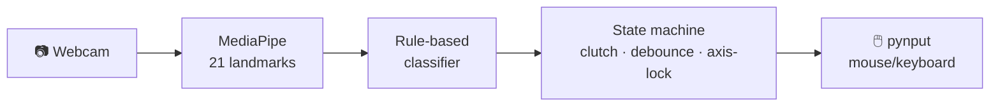

<div align="center">


# 🖐️ MaraMouse

### Control your PC with hand gestures — turn your webcam into a mouse

[](https://www.python.org/)
[](https://developers.google.com/mediapipe)
[](https://opencv.org/)
[](#)
[](#)
[](#)
[](#)
[](LICENSE)

*Move the cursor, click, scroll, zoom and toggle dictation — touching nothing.*

**English** · [Italiano](README.md)

</div>

---

## ✨ What it is

**MaraMouse** turns your laptop webcam into a gesture mouse. The cursor moves **by delta** like a physical mouse (not by absolute position): open your hand and move it, the cursor follows; make a fist to "lift off" and reposition your hand — exactly like picking a mouse up off the mat.

It runs **locally, CPU-only, at zero cost**: no cloud, no GPU, no subscriptions. Just MediaPipe, OpenCV and pynput.

## 🎯 Gestures

All gestures work only when the system is **engaged** (see [Engagement](#-engagement--audio-feedback)).

| Gesture | Action |
|:--|:--|
| ✋ **Open hand** moving | Move the cursor |
| ✊ **Fist** | Pause / lift-off (reposition your hand) — and engages from standby |
| ☝️ **Index finger**, quick down-up tap | Left click |
| ☝️☝️ **Two taps** of the index finger | Double click |
| 🖕 **Middle finger**, down-up tap | Right click |
| ✌️ **Peace sign** (index+middle) moved | Vertical / horizontal scroll |
| 🤏 **Pinch** thumb-index | Zoom in / out |
| 🤘 **Horns** (index+pinky) | Toggle dictation (Win+H) |

## 🔊 Engagement & audio feedback

The system starts in **standby** and won't touch the mouse: you can move around freely. Three distinct *whooshes* tell you what's happening:

| Sound | Meaning |
|:--|:--|
| 🔵 Detection whoosh | Hand detected while in standby |
| 🔼 **Engage** whoosh | **Engaged** — hold a fist for ~1s |
| 🔽 **Disengage** whoosh | Back to **standby** (after ~45s of inactivity) |

This prevents the cursor from taking off every time you move without meaning to control the PC.

## 🚀 Install

> Requires **Python 3.10** on Windows.

```bash
git clone https://github.com/pilgrimdelamare/MaraMouse.git
cd MaraMouse
pip install -r requirements.txt
```

> ⚠️ **Important:** MediaPipe is pinned to `0.10.14`. Newer releases removed the `mp.solutions.hands` API and **fail to detect the hand on CPU** — do not upgrade.

## ▶️ Usage

The quickest way: **double-click `MaraMouse.bat`**. Otherwise, from a terminal:

```bash
python main.py                # normal run (built-in webcam)
python main.py --debug        # show the hand skeleton and DON'T move the mouse
python main.py --source 1     # use a different webcam
python diag.py                # diagnostics: camera, model, tracking quality
```

In the preview window:
- **`q`** quit
- **`1` / `2`** switch webcam source

**First run:** it starts in `STANDBY`. Show your hand (you'll hear a whoosh), then **make a fist and hold it ~1s** until the bar fills and you hear the engage whoosh: now you're `ACTIVE`.

### 🖱️ Desktop shortcut (with icon)

To get a desktop shortcut with the MaraMouse icon, run once:

```powershell
powershell -ExecutionPolicy Bypass -File Crea-Collegamento.ps1
```

It creates `MaraMouse.lnk` on the desktop, pointing to `MaraMouse.bat` with the icon `assets/MaraMouseLogo.ico`.

## 🧠 How it works



- **Tracking** — MediaPipe Hand Landmarker extracts 21 hand points per frame.
- **Classification** — geometric rules on the landmarks decide the gesture (no neural network to train).
- **State machine** — arbitrates between gestures with anti-false-positive debounce, handles the movement clutch, scroll axis-lock, tap detection and double click, engagement and inactivity timeout.
- **Actions** — pynput injects mouse and keyboard events at the OS level.

A **threaded** webcam reader drops stale frames to avoid accumulating latency.

## 🗂️ Layout

```
MaraMouse/
├── MaraMouse.bat         # launcher (double-click)
├── Crea-Collegamento.ps1 # creates the desktop shortcut with icon
├── assets/               # logo (png/ico)
├── main.py               # main loop, preview/HUD, sounds
├── camera.py             # video source (threaded reader)
├── hand_tracker.py       # MediaPipe wrapper (mp.solutions.hands)
├── gesture_classifier.py # geometric rules on landmarks
├── state_machine.py      # gesture arbitration, clutch, engagement
├── actions.py            # pynput + whoosh sounds (winsound)
├── config.py             # all tunable thresholds
├── diag.py               # diagnostics
└── requirements.txt
```

## ⚙️ Configuration

All knobs live in [`config.py`](config.py):

| Area | Parameters |
|:--|:--|
| Cursor | `CURSOR_SENSITIVITY`, `CURSOR_SMOOTHING` |
| Click | `CLICK_TAP_THRESHOLD`, `CLICK_TAP_RELEASE`, `DOUBLE_CLICK_WINDOW_FRAMES` |
| Scroll | `SCROLL_SENSITIVITY`, `SCROLL_DEAD_ZONE`, `SCROLL_AXIS_LOCK_FRAMES` |
| Zoom | `PINCH_ACTIVATE_DISTANCE`, `PINCH_MIN/MAX_DISTANCE` |
| Dictation | `DICTATION_HOLD_FRAMES` |
| Engagement | `ENGAGE_HOLD_FRAMES`, `INACTIVITY_TIMEOUT_FRAMES` |

## 🛠️ Troubleshooting

| Problem | Fix |
|:--|:--|
| Hand not detected (0%) | Check `mediapipe==0.10.14` (`pip show mediapipe`). Newer versions don't work on CPU |
| Jittery tracking | Improve lighting, avoid backlight, keep the hand well framed |
| Cursor won't move | You're in standby: hold a fist ~1s to engage |
| Diagnostics | `python diag.py` reports detection %, hand size and brightness |

## 📋 Requirements

- Python 3.10 · Windows
- A webcam
- `mediapipe==0.10.14`, `opencv-python`, `pynput`, `numpy`

## 📄 License

Released under the **MIT** license — see [`LICENSE`](LICENSE).
