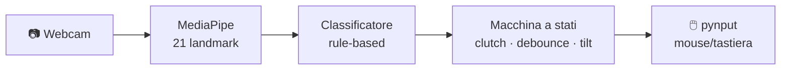

<div align="center">


# 🖐️ MaraMouse

### Controlla il PC con i gesti della mano — la tua webcam diventa un mouse

[](https://www.python.org/)
[](https://developers.google.com/mediapipe)
[](https://opencv.org/)
[](#)
[](#)
[](#)
[](#)
[](LICENSE)

*Muovi il cursore, clicca, scrolla, zooma e attiva la dettatura — senza toccare niente.*

[English](README.en.md) · **Italiano**

</div>

---

## ✨ Cos'è

**MaraMouse** trasforma la webcam del laptop in un mouse a gesti. Il cursore si muove **per delta** come un mouse fisico (non per posizione assoluta): apri la mano e la muovi, il cursore la segue; chiudi il pugno per "staccare" e riposizionare la mano, esattamente come sollevare un mouse dal tappetino.

Gira **in locale, solo su CPU, a costo zero**: niente cloud, niente GPU, niente abbonamenti. Solo MediaPipe, OpenCV e pynput.

## 🎯 Gesti

Tutti i gesti funzionano solo quando il sistema è **agganciato** (vedi [Aggancio](#-aggancio-e-feedback-audio)).

| Gesto | Azione |
|:--|:--|
| ✋ **Mano aperta** in movimento | Muove il cursore |
| ✊ **Pugno chiuso** | Pausa / stacco (riposiziona la mano) |
| 🤙 **Segno del telefono** (pollice+mignolo) ~1s | Toggle aggancio / standby |
| ☝️ **Indice alzato** dal pugno | Click sinistro |
| ☝️☝️ **Indice+medio alzati** insieme | Doppio click |
| 🖕 **Medio alzato** da solo | Click destro |
| 🖐️ **3 dita** (I+M+R) + inclinazione mano | Scroll verticale (joystick) |
| 🤏 **Pinch** pollice-indice | Zoom in / out |
| 🤘 **Corna** (indice+mignolo) | Toggle dettatura (Win+H) |

## 🔊 Aggancio e feedback audio

Il sistema parte in **standby** e non tocca il mouse: puoi muoverti liberamente. Tre *woosh* distinti ti dicono cosa sta succedendo:

| Suono | Significato |
|:--|:--|
| 🔵 Woosh di rilevamento | Mano rilevata mentre sei in standby |
| 🔼 Bip di **aggancio** | **Agganciato** — tieni il segno del telefono ~1s |
| 🔽 Woosh di **sgancio** | Tornato in **standby** (dopo ~45s di inattività, o segno del telefono ~1s) |

Questo evita che il cursore parta da solo ogni volta che ti muovi senza intenzione di controllare il PC.

## 🚀 Installazione

> Richiede **Python 3.10** su Windows.

```bash
git clone https://github.com/pilgrimdelamare/MaraMouse.git
cd MaraMouse
pip install -r requirements.txt
```

> ⚠️ **Importante:** la versione di MediaPipe è bloccata a `0.10.14`. Le release più recenti hanno rimosso l'API `mp.solutions.hands` e **non rilevano la mano su CPU** — non aggiornarla.

## ▶️ Uso

Il modo più rapido: **doppio click su `MaraMouse.bat`**. In alternativa, da terminale:

```bash
python main.py                # avvio normale (webcam integrata)
python main.py --debug        # mostra lo scheletro della mano e NON muove il mouse
python main.py --source 1     # usa un'altra webcam
python diag.py                # diagnostica: camera, modello, qualità del tracking
```

Nella finestra di anteprima:
- **`q`** esce
- **`1` / `2`** cambia sorgente webcam

**Primo avvio:** al lancio è in `STANDBY`. Mostra la mano (senti un woosh), poi fai il **segno del telefono** (pollice+mignolo estesi, altre dita chiuse) **e tienilo ~1s** finché la barretta si riempie e senti il bip di aggancio: ora sei `ACTIVE`. Per tornare in standby, rifai lo stesso segno ~1s.

### 🖱️ Collegamento sul desktop (con icona)

Per avere un collegamento sul desktop con l'icona di MaraMouse, esegui una volta:

```powershell
powershell -ExecutionPolicy Bypass -File Crea-Collegamento.ps1
```

Crea `MaraMouse.lnk` sul desktop, che punta a `MaraMouse.bat` con l'icona `assets/MaraMouseLogo.ico`.

## 🧠 Come funziona



- **Tracking** — MediaPipe Hand Landmarker estrae 21 punti della mano da ogni frame.
- **Classificazione** — regole geometriche sui landmark decidono il gesto (niente rete neurale da addestrare).
- **Macchina a stati** — arbitra tra i gesti con debounce anti-falsi-positivi, gestisce il clutch del movimento, il click per alzata dito, lo scroll per inclinazione mano, l'aggancio e il timeout di inattività.
- **Azioni** — pynput inietta gli eventi di mouse e tastiera a livello OS.

Un **lettore threaded** della webcam scarta i frame vecchi per evitare l'accumulo di ritardo.

## 🗂️ Struttura

```
MaraMouse/
├── MaraMouse.bat         # launcher (doppio click)
├── Crea-Collegamento.ps1 # crea il collegamento sul desktop con icona
├── assets/               # logo (png/ico)
├── main.py               # loop principale, preview/HUD, suoni
├── camera.py             # sorgente video (lettore threaded)
├── hand_tracker.py       # wrapper MediaPipe (mp.solutions.hands)
├── gesture_classifier.py # regole geometriche sui landmark
├── state_machine.py      # arbitraggio gesti, clutch, aggancio
├── actions.py            # pynput + suoni woosh (winsound)
├── config.py             # tutte le soglie tarabili
├── diag.py               # diagnostica
└── requirements.txt
```

## ⚙️ Configurazione

Tutte le manopole sono in [`config.py`](config.py):

| Ambito | Parametri |
|:--|:--|
| Cursore | `CURSOR_SENSITIVITY`, `CURSOR_SMOOTHING` |
| Click | `CLICK_COOLDOWN_FRAMES` |
| Scroll | `SCROLL_TILT_DEAD_ZONE`, `SCROLL_TILT_SENSITIVITY` |
| Zoom | `PINCH_ACTIVATE_DISTANCE`, `PINCH_MIN/MAX_DISTANCE` |
| Dettatura | `DICTATION_HOLD_FRAMES` |
| Aggancio | `ENGAGE_HOLD_FRAMES`, `ENGAGE_COOLDOWN_FRAMES`, `INACTIVITY_TIMEOUT_FRAMES` |

## 🛠️ Troubleshooting

| Problema | Soluzione |
|:--|:--|
| Non rileva la mano (0%) | Verifica `mediapipe==0.10.14` (`pip show mediapipe`). Le versioni recenti non funzionano su CPU |
| Il tracking è a scatti | Migliora l'illuminazione ed evita il controluce; tieni la mano ben inquadrata |
| Il cursore non si muove | Sei in standby: fai il segno del telefono (pollice+mignolo) ~1s per agganciare |
| Diagnostica | `python diag.py` misura % di rilevamento, dimensione della mano e luminosità |

## 📋 Requisiti

- Python 3.10 · Windows
- Webcam
- `mediapipe==0.10.14`, `opencv-python`, `pynput`, `numpy`

## 📄 Licenza

Distribuito con licenza **MIT** — vedi [`LICENSE`](LICENSE).
