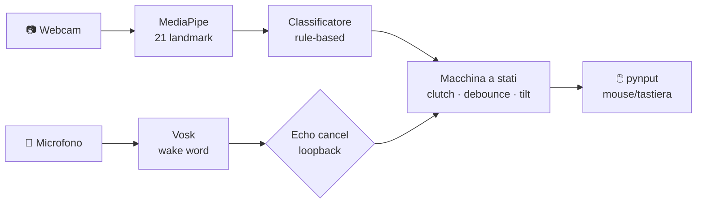

<div align="center">


# 🖐️ MaraMouse

### Controlla il PC con i gesti della mano — la tua webcam diventa un mouse

[](https://www.python.org/)
[](https://developers.google.com/mediapipe)
[](https://opencv.org/)
[](#)
[](#)
[](#)
[](#)
[](LICENSE)

*Muovi il cursore, clicca, scrolla, zooma e attiva la dettatura — senza toccare niente.*

[English](README.en.md) · **Italiano**

</div>

---

## ✨ Cos'è

**MaraMouse** trasforma la webcam del laptop in un mouse a gesti. Il cursore si muove **per delta** come un mouse fisico (non per posizione assoluta): apri la mano e la muovi, il cursore la segue; chiudi il pugno per "staccare" e riposizionare la mano, esattamente come sollevare un mouse dal tappetino.

Gira **in locale, solo su CPU, a costo zero**: niente cloud, niente GPU, niente abbonamenti.

## 🎯 Gesti

Tutti i gesti funzionano solo quando il sistema è **agganciato** (vedi [Aggancio](#-aggancio-e-feedback-audio)).

| Gesto | Azione |
|:--|:--|
| ✋ **Mano aperta** in movimento | Muove il cursore |
| ✊ **Pugno chiuso** | Pausa / stacco (riposiziona la mano) |
| 🤙 **Segno del telefono** (pollice+mignolo) ~1s | Toggle aggancio / standby |
| ☝️ **Indice alzato** dal pugno | Click sinistro |
| ✌️ **Indice+medio alzati** insieme | Doppio click |
| 🖕 **Medio alzato** da solo | Click destro |
| 🖐️ **3 dita** (I+M+R) + inclinazione mano | Scroll verticale (joystick) |
| 🤏 **Pinch** pollice-indice | Zoom in / out |
| 🤘 **Corna** (indice+mignolo) | Toggle dettatura (Win+H) |

## 🔊 Aggancio e feedback audio

Il sistema parte in **standby** e non tocca il mouse. L'attivazione è a **due fattori** (voce + gesto) per evitare attivazioni accidentali.

### Flusso di attivazione

1. **IDLE** — il sistema ascolta il microfono. Di' **"Maramouse"** per attivare.
2. **ARMED** — voce riconosciuta, doppio bip (600+800 Hz). Mostra la mano → *woosh*. Hai **8 secondi** per fare il **segno del telefono** (~1s).
3. **ACTIVE** — bip 900 Hz. I gesti controllano il mouse. Per sganciare: segno del telefono ~1s, oppure attendi ~45s di inattività.

| Suono | Significato |
|:--|:--|
| 🔔 Doppio bip (600+800 Hz) | Voce riconosciuta → ARMED |
| 👋 Woosh | Mano rilevata (in ARMED) |
| 🔼 Bip 900 Hz | Agganciato → ACTIVE |
| 🔽 Woosh sgancio | Tornato in standby |

### Echo cancellation TV

Se il PC è collegato a una TV via HDMI, il sistema può catturare il loopback audio WASAPI e **ignorare la wake word quando è la TV a parlare**. Un secondo riconoscitore Vosk gira sul loopback: se anche il loopback contiene "Maramouse", il trigger viene rifiutato.

Configura l'uscita TV dalle **Impostazioni** (`s` nella finestra di anteprima).

### Senza gate vocale

`python main.py --no-audio` disabilita il riconoscimento vocale e usa il flusso diretto: segno del telefono → ACTIVE.

## 🚀 Installazione

> Richiede **Python 3.10** su Windows.

```bash
git clone https://github.com/pilgrimdelamare/MaraMouse.git
cd MaraMouse
pip install -r requirements.txt
```

> ⚠️ **Importante:** la versione di MediaPipe è bloccata a `0.10.14`. Le release più recenti hanno rimosso l'API `mp.solutions.hands` e **non rilevano la mano su CPU** — non aggiornarla.

### Dipendenze opzionali

| Pacchetto | A cosa serve |
|:--|:--|
| `speechbrain`, `torch` | Speaker verification (impronta vocale) — facoltativo, ~2GB |
| `openwakeword` | Backend alternativo per wake word (se hai un modello ONNX custom) |

## ▶️ Uso

Il modo più rapido: **doppio click su `MaraMouse.bat`**. In alternativa, da terminale:

```bash
python main.py                # avvio normale (webcam integrata)
python main.py --debug        # mostra lo scheletro della mano e NON muove il mouse
python main.py --no-audio     # disabilita gate vocale (solo gesto telefono)
python main.py --source 1     # usa un'altra webcam
python main.py --list-devices # mostra i dispositivi audio disponibili
python diag.py                # diagnostica: camera, modello, tracking
python diag_audio.py          # diagnostica audio: wake word in tempo reale
```

Nella finestra di anteprima:
- **`q`** esce
- **`s`** apre le **Impostazioni** (webcam, microfono, uscita TV, impronta vocale)
- **`1` / `2` / `3`** cambia sorgente webcam

### 🖱️ Collegamento sul desktop (con icona)

```powershell
powershell -ExecutionPolicy Bypass -File Crea-Collegamento.ps1
```

## 🧠 Come funziona



- **Tracking** — MediaPipe Hand Landmarker estrae 21 punti della mano da ogni frame.
- **Classificazione** — regole geometriche sui landmark decidono il gesto (niente rete neurale).
- **Macchina a stati** — arbitra tra i gesti con debounce, gestisce clutch, click per alzata dito, scroll per inclinazione, aggancio a tre stati (IDLE/ARMED/ACTIVE).
- **Gate vocale** — Vosk con grammatica vincolata riconosce "Maramouse". Un secondo Vosk sul loopback WASAPI filtra i falsi positivi dalla TV.
- **Azioni** — pynput inietta gli eventi di mouse e tastiera a livello OS.

## 🗂️ Struttura

```
MaraMouse/
├── MaraMouse.bat         # launcher (doppio click)
├── Crea-Collegamento.ps1 # crea il collegamento sul desktop con icona
├── assets/               # logo (png/ico), suoni (wav)
├── main.py               # loop principale, preview/HUD, suoni
├── camera.py             # sorgente video (lettore threaded)
├── hand_tracker.py       # wrapper MediaPipe (mp.solutions.hands)
├── gesture_classifier.py # regole geometriche sui landmark
├── state_machine.py      # arbitraggio gesti, clutch, aggancio 3 stati
├── audio_gate.py         # wake word (Vosk) + echo cancellation + speaker verification
├── actions.py            # pynput + suoni woosh (winsound)
├── config.py             # tutte le soglie tarabili
├── settings.py           # pannello impostazioni (tkinter)
├── diag.py               # diagnostica camera/tracking
├── diag_audio.py         # diagnostica audio/wake word
├── enroll_voice.py       # registrazione impronta vocale (CLI)
├── models/               # modelli e embedding (generati localmente)
└── requirements.txt
```

## ⚙️ Configurazione

Premi **`s`** nella finestra di anteprima per aprire le **Impostazioni**:
- **Webcam** — seleziona la sorgente video
- **Microfono** — seleziona il dispositivo di input
- **Uscita TV / HDMI** — seleziona lo speaker per l'echo cancellation
- **Impronta vocale** — registra la tua voce per la speaker verification (facoltativo)

Tutte le soglie avanzate sono in [`config.py`](config.py):

| Ambito | Parametri |
|:--|:--|
| Cursore | `CURSOR_SENSITIVITY`, `CURSOR_SMOOTHING` |
| Click | `CLICK_COOLDOWN_FRAMES` |
| Scroll | `SCROLL_TILT_DEAD_ZONE`, `SCROLL_TILT_SENSITIVITY` |
| Zoom | `PINCH_ACTIVATE_DISTANCE`, `PINCH_MIN/MAX_DISTANCE` |
| Dettatura | `DICTATION_HOLD_FRAMES` |
| Aggancio | `ENGAGE_HOLD_FRAMES`, `ENGAGE_COOLDOWN_FRAMES`, `INACTIVITY_TIMEOUT_FRAMES` |
| Gate vocale | `WAKE_WORD_THRESHOLD`, `SPEAKER_THRESHOLD`, `ARMED_TIMEOUT_FRAMES` |

## 🛠️ Troubleshooting

| Problema | Soluzione |
|:--|:--|
| Non rileva la mano (0%) | Verifica `mediapipe==0.10.14` (`pip show mediapipe`). Le versioni recenti non funzionano su CPU |
| Il tracking è a scatti | Migliora l'illuminazione ed evita il controluce |
| Il cursore non si muove | Sei in standby: di' "Maramouse", poi segno del telefono ~1s |
| La TV attiva il wake word | Configura l'uscita TV nelle Impostazioni (`s`) per l'echo cancellation |
| "Maramouse" non viene riconosciuto | Prova `python diag_audio.py` per vedere il riconoscimento in tempo reale |
| Diagnostica | `python diag.py` (video) · `python diag_audio.py` (audio) |

## 📋 Requisiti

- Python 3.10 · Windows
- Webcam
- `mediapipe==0.10.14`, `opencv-python`, `pynput`, `numpy`, `sounddevice`, `soundcard`, `vosk`

## 📄 Licenza

Distribuito con licenza **MIT** — vedi [`LICENSE`](LICENSE).
